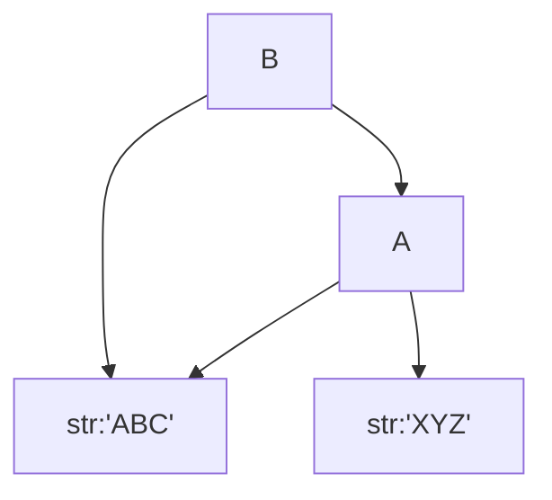

#*Python基础学习*

##一、PYthon变量和数据类型
**1、整数和浮点数**
**整数**：注意进制，十进制照常，十六进制注意前面加`0x`
**浮点数**：注意大数使用科学计数法记录，10使用e替代，如，1.23e-5代表0.0000123
**另**：整数和浮点数的计数方式不相同，整数运算是精确的（包括除法），而浮点数运算可能会有四舍五入的误差。
**2、字符串**
使用`""`·或者`''`括起来的任意文本
**3、布尔值**
`True`和`False`两种值（注意大小写），可以通过`and`，`or`，`not`进行运算
**4、空值**
使用`None`来进行表示，不能理解为0
- - -
**5、print**
`print`可以跟上多个字符串，通过逗号`,`进行连接，这时，遇到`,`会自动输出一个空格，也可以通过`+`进行连接，不输出空格。
**6、注释**
通过`#`进行注释
- - -
**7、变量**
<font color=red>变量名必须是大小写英文、数字和下划线（_）的组合，但不能用数字开头</font>
```
a = 123 #a是整数
print a
a = 'abd' #a变为字符串
print a
```
python是动态语言，区别于Java静态语言（不能赋不同类型的值）
**变量在计算机内存中的表示**
当`a='ABC'`时，python解释器干了两件事情：
1、在内存中创建了一个`'ABC'`的字符串；
2、在内存中创建了一个`a`的变量，并把它指向`'ABC'`。
也可以把一个变量a赋值给另一个变量b，这个操作实际上是把变量b指向变量a所指向的数据，例如下面的代码：
```
a = 'ABC'
b = a
a = 'XYZ'
print b
```

**8、定义字符串**
字符串可以使用`""`或`''`括起来表示
如果字符串既包含`"`，又包含`'`,则需要对某些特殊字符串进行”<font color="red">转义</font>“，python使用`\`进行转义。
**9、Unicode字符串**
建议在文件第一行使用
```
# -*- coding: utf-8 -*-
```
进行注释
**10、整数和浮点数**
整数运算结果是整数
浮点数运算是浮点数
整数和浮点数运算是浮点数
**11、布尔类型**
与或非运算
```
a = True
print a and 'a=T' or 'a=F'#结果为a=T
```
因为Python把`0`、`空字符串''`和`None`看成<font color=red>False，其他数字和非空字符串都看成True</font>，所以：
```
True and 'a=T'计算结果为'a=T'
继续计算'a=T'or'a=F'计算结果还是'a=T'
```
and和or运算重要法则：<font color=red>短路运算</font>
1、在计算`a and b`时，如果a是False，ze根据与运算法则，整个结果必定为False，因此返回a；如果a是True，则整个计算结果必定取决于b，因此返回b；
2、在计算`a or b`时，如果a是True，则根据或运算法则，整个计算结果必定为True，因此返回a；如果a是False，则整个计算结果必定取决于b，因此返回b
所以Python解释器在做布尔运算时，只要能提前确定计算结果，它就不会往后算了，直接返回结果。

##二、List和tuple类型
##三、条件判断和循环
##四、Dict和Set类型
##五、函数
##六、切片
##七、迭代
##八、列表生成式